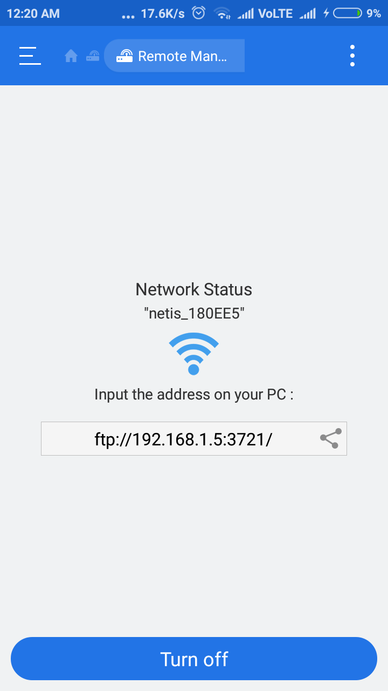

# FTP TOOL

[](https://www.python.org/) 

This is a script to download an entire folder from a ftp server.

Made to solve one simple problem of mine, transfer files from my cellphone to PC wirelessly using ftp server available with file manager refer screenshot below.

<div align="center">

</div>

----------------------------------------------------------------------

## Usage 

Edit the following parameters in the file ( command line arguments comming soon :P )

```python

HOST = ''
PORT = xxxx #integer

USERNAME = ''
PASSWORD = ''

...
...

ftp_directory = ''
save_directory = ''

```

then run the script `python FtpClient.py`.
This will download the entire content of `ftp_directory`


## Features

1. Zero requirements: Works with python without any libraries
2. Downloads entire directory recursively
3. Multithreading supported 


## To-do

1. Add Threading support with download progress
2. Add Command line arguments


## Contributions

Please write to me at [chaitya.shah@somaiya.edu]()


## Author
[@Chaitya62](https://github.com/Chaitya62)

